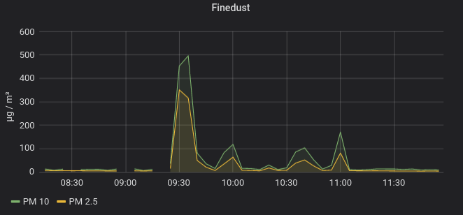

# SDS011-MQTT

... is a Linux Python script/service to control the fine dust sensor SDS011 via MQTT. 

**Discontinued:** The code worked fine. But 3 sensors broke down after 2 to 5 weeks (outside under roof). There seems to be problems with humidity. 
In the end the sensor reported all time the same measurements, which cannnot be true.  


## Motivation 

The fine dust measurements should reflect when my neighbor fires his wood stove, so that I can switch off my air-handling system of my house before the smell (not the fume) is spread all over.

  

In theory the idea works. In the Grafana screen shot you see an heating period. Some more information about that topic can be found [here](./doc/MOTIVATION.md).

Controlling the sensor is not much intellectual work, but in practice it didn't work so easily. The sensor was located outside and exposed up to 100% humidity. This lead to several problems, where the sensor refused to work. You could put the sensor back to a room and all worked fine again. The solution was an alternating working mode, where the sensor fan drys the sensor or if it doesn't help the whole sensor is restarted via an external power switch.

By the way, the sensor was put outside under the roof and controlled by a Raspberry Pi from inside. Therefor the USB connection was replaced with Bluetooth (through the wall). See my notes [here](./doc/BLUETOOTH.md).

The measurements are published to a MQTT server, from where it can be processed further. [MQTT](https://en.wikipedia.org/wiki/MQTT) is an open, standardized, publish-subscribe network protocol that transports messages between different systems. Among others the smart home systems  [OpenHAB](https://www.openhab.org/) and [Node-RED](https://nodered.org/) support it.


## Features

- Controls a SDS011 fine dust sensor
- Trigger measurement in configurable intervals (Option for adaptive measurement intervals to detect dust peaks)
- Deliver measurements as JSON to MQTT
- Send sensor to sleep after measurements
- Option to switch on/off the sensor by an external power relay via MQTT command (separate control channel)
- Automatic deactivation of sensor  
    - If humidity/temperature exceeds configured limits (provide humidity/temperature via MQTT).
    - for specific time ranges (configuration)
    - via MQTT command channel (set to "HOLD" by smart home system)
- Operation system: Linux incl. Raspbian for Raspberry Pi
- systemd service script provided
- Programmed with Python 3.6


## Startup

### prepare connection

In case you connect the sensor via USB you may need to set some permissions:  
```bash
# enable access to Enocean USB stick (alternative set user mode directly)
sudo usermod -a -G dialout $USER
# logout & login
```

I connect it via Bluetooth. See my notes [here](./doc/BLUETOOTH.md).


### Test working MQTT broker (here Mosquitto)
```bash
sudo apt-get install mosquitto-clients

# preprare credentials
SERVER="<your server>"
MQTT_USER="<user>"
MQTT_PWD="<pwd>"

# start listener
mosquitto_sub -h $SERVER -p 8883 -u $MQTT_USER -P $MQTT_PWD --cafile /etc/mosquitto/certs/ca.crt -i "client_sub" -d -t smarthome/#
# or
mosquitto_sub -h $SERVER -p 1883 -i "client_sub" -d -t smarthome/#

# send single message
mosquitto_pub -h $SERVER -p 8883 -u $MQTT_USER -P $MQTT_PWD --cafile /etc/mosquitto/certs/ca.crt -i "client_pub" -d -t smarthome/test -m "test_$(date)" -q 2
# or
mosquitto_pub -h $SERVER -p 1883 -i "client_pub" -d -t smarthome/test -m "test_$(date)" -q 2

# just as info: clear retained messages
mosquitto_pub -h $SERVER -p 1883 -i "client_pub" -d -t smarthome/test -n -r -d
```

### Prepare python environment
```bash
cd /opt
sudo mkdir sds011-mqtt
sudo chown pi:pi sds011-mqtt  # type in your user
git clone https://github.com/rosenloecher-it/sds011-mqtt sds011-mqtt

cd sds011-mqtt
virtualenv -p /usr/bin/python3 venv

# activate venv
source ./venv/bin/activate

# check python version >= 3.7
python --version

# install required packages
pip install -r requirements.txt
```


### Run

```bash
# prepare your own config file based on ./sds011-mqtt.yaml.sample . See comments!
cp ./sds011-mqtt.yaml.sample ./sds011-mqtt.yaml

# see command line options
./sds011-mqtt.sh --help

# run
./sds011-mqtt.sh -p -c ./sds011-mqtt.yaml
```

## Register as systemd service
```bash
# prepare your own service script based on sds011-mqtt.service.sample
cp ./sds011-mqtt.service.sample ./sds011-mqtt.service

# edit/adapt pathes and user in sds011-mqtt.service
vi ./sds011-mqtt.service
# configure optional `ExecStartPre` commands. e.g. prepareing a serial Bluetooth port

# install service
sudo cp ./sds011-mqtt.service /etc/systemd/system/
# alternativ: sudo cp ./sds011-mqtt.service.sample /etc/systemd/system//sds011-mqtt.service
# after changes
sudo systemctl daemon-reload

# start service
sudo systemctl start sds011-mqtt

# check logs
journalctl -u sds011-mqtt

# enable autostart at boot time
sudo systemctl enable sds011-mqtt.service
```


## Troubleshooting

There happened some very quick connects/disconnects from/to MQTT broker (Mosquitto) on a Raspberry Pi. The connection was secured only by certificate. The problem went away after configuring user name and password for the MQTT broker. On a Ubuntu system all was working fine even without user and password.

`sudo service sds011-mqtt status`

Mar 18 06:22:18 server systemd[1]: sds011-mqtt.service: Current command vanished from the unit file, execution of the command list won't be resumed.

```
sudo systemctl disable sds011-mqtt.service
sudo rm /etc/systemd/system/sds011-mqtt.service
sudo systemctl daemon-reload

sudo cp ./sds011-mqtt.service /etc/systemd/system/
sudo rm /etc/systemd/system/sds011-mqtt.service
sudo service sds011-mqtt start
sudo systemctl enable sds011-mqtt.service
```


## Related projects

- Based on: [py-sds011](https://github.com/ikalchev/py-sds011)


## Maintainer & License

MIT © [Raul Rosenlöcher](https://github.com/rosenloecher-it)

The code is available at [GitHub][home].

[home]: https://github.com/rosenloecher-it/sds011-mqtt

