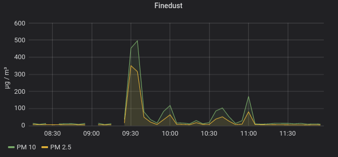

# Motivation for SDS011-MQTT

The goal was to put the sensor outside under the roof and control it from inside with a Raspberry Pi. Therefor the USB connection was replaced with Bluetooth (through the wall).

The measurements are published to a MQTT server, from where it can be processed further. 

The measurements should reflect when my neighbor fires his wood stove especially private waste combustion, so that I can switch off my air-handling system of my house before the smell (not the fume) is spread all over.  

In principle the idea works. The fine dust measurements correlate to the fume/smell.

The highest value (peak) I measured were 496 µg/m³ (PM 10) and 352 µg/m³ (PM 2.5). These are peak values and not comparable with dust average limits (40 µg/m³) for ban on Diesel-powered vehicles in Germany. Normally the dust values varies between 1 and 15 µg/m³.

Just to get an impression: So my neighbors house looked like when the peak value was measured. 
The wind was blowing the fumes to my house.

In practice, the sensor is very peaky about humidity. The sensor is specified up to 70% humidity, which is topped every normal night in middle Europa and when it's raining. 

When the sensor runs at humid circumstances, it will stop delivering values. Unfortunately there is no error code or other information, what's going wrong. 

Even though you regard these limit (switch off the sensor by power switch at humid conditions), the sensor malfunction quite often. For example, sometimes after a rainy period/day it takes several hours under proper condition to recover and send values again. For hours I get exactly the same measurement values. Does the sensor get soaked?! But this malfunction occurs also under normal conditions, where no reason is so obvious.

For such ambiguous behavior I deigned a specific working mode: The sensor is powered on and the fan will run until a positive measurement and hopefully drying the sensor (theory). If there is no success after 10 (configurable) shots, the service will stop. Then the sensor get powered off and restarted by systemd after 5 minutes. 

